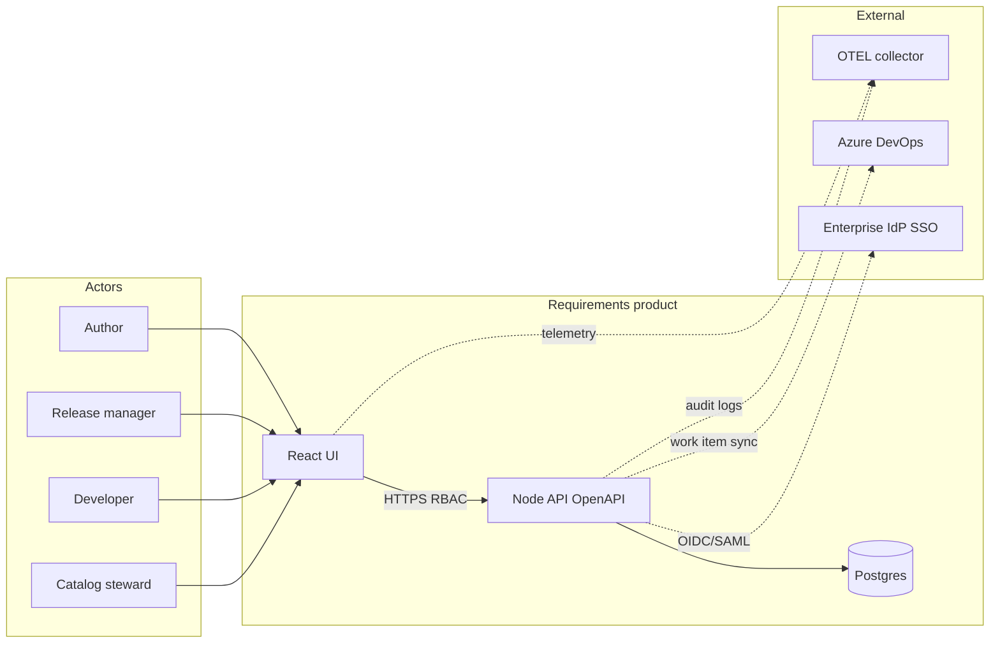
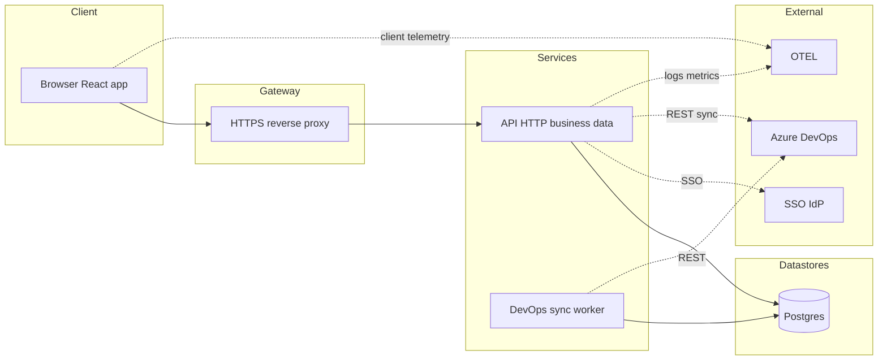
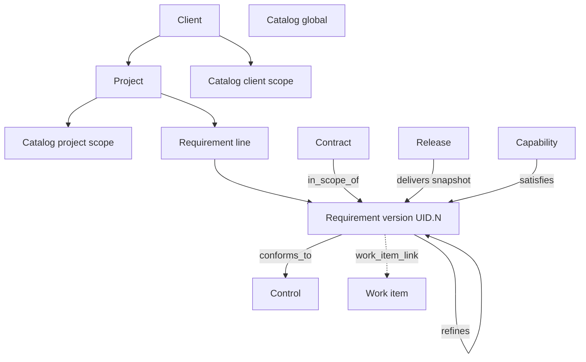
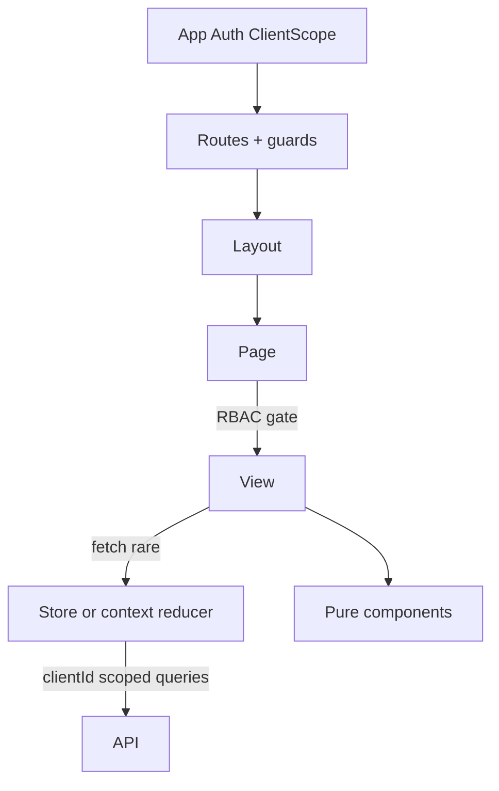
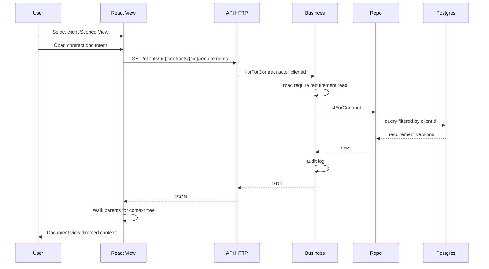
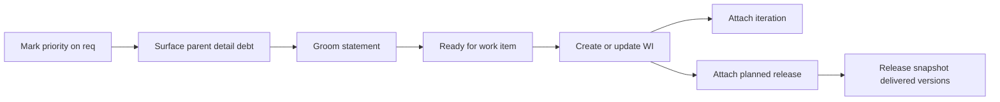

# Requirements product — architecture, context, data flow

Locked 2026-10-06: Client→Project hierarchy, contracts as related objects, `.N` requirement versions, TS/Node schema-first, Scoped View by client.

## 1. System context

## 2. Runtime architecture

### 2a. Authentication, key store, and deploy topology (foundation slice)

- **Internal OAuth 2.1 AS** (ARCH-AUTH-AS) runs in the API role and is the **only** token issuer for the Web UI, API, and MCP server. It supports authorization code + PKCE (S256 only), RFC 8414 metadata, RFC 9728 protected-resource metadata on both the API and MCP, RFC 8707 audience-bound tokens, refresh rotation with reuse detection, and revocation. Clients are pre-registered; CIMD and DCR are policy-gated, and DCR is off by default.
- **Enterprise SSO** (A01 / CAP-SSO) federates **upstream through the AS** (ARCH-AUTH-FEDERATION). Upstream IdP tokens never reach the API or MCP.
- **Identity mode** (ARCH-AUTH-PROFILE): production defaults to `identity_mode=federated`, `local_accounts=disabled`, so A01's "no local password store" holds by default. Local accounts are optional (dev seed, break-glass recovery admin, or an explicit profile opt-in; ARCH-AUTH-LOCAL.1 / ARCH-AUTH-LOCAL-BREAKGLASS). **OAuth via the internal AS is mandatory for MCP in every mode** (ARCH-AUTH-MCP-REQUIRED). Upstream IdPs attach through per-tenant connectors with explicit claim mapping and honored upstream logout. Options for calling provider APIs on the user's behalf are in [`../auth/mcp-upstream-identity.md`](../auth/mcp-upstream-identity.md) (not locked).
- **Credential store** (ARCH-CRED-*): salted one-way hashes (Argon2id, or PBKDF2 under FIPS), password policy, lockout/throttle, MFA for privileged roles, hashed server-side tokens, idle/absolute session timeouts, step-up for approvals and pin applies, and audit through the AuditLog pattern.
- **Key store** (ARCH-KEY-*): envelope encryption. The KEK lives in the KeyProvider (default **OpenBao Transit**; cloud KMS and HSM/PKCS#11 can be plugged in). DEKs are stored only wrapped. Signing keys are non-exportable with a `kid` and a rotation overlap. Key ops require the deployment-scoped **Key custodian**. Production fails closed if the KeyProvider is unavailable.
- **Deploy units** (ARCH-DEPLOY-MINIMAL / ARCH-DEPLOY-PERIPHERALS): one Dockerfile builds everything. A single **app** container runs the API (+AS), Web UI, MCP server, and sync worker, with roles toggled by `REQALM_ROLES` so they can split later. In dev, one **peripherals** container runs Postgres + OpenBao. In production, Postgres and OpenBao are separate units (the key store is isolated from the DB it protects). The C4 L2 boxes are logical containers.
- **Build order** (ARCH-BUILD-FOUNDATION): shell + auth + credential store + key store + RBAC + audit + health ship first. This is sequencing only, not a v1 scope cut.

Sequences: [AS01](./sequences/AS01-mcp-oauth-authorize.puml), [AS02](./sequences/AS02-local-login-lockout-mfa.puml), [AS03](./sequences/AS03-federated-sso-via-as.puml), [KS01](./sequences/KS01-kek-rotate-dek-rewrap.puml), [KS02](./sequences/KS02-token-signing-keyprovider.puml).

## 3. Domain object graph

## 4. UI data ownership

Routes and RBAC guards wrap the layout shell; pages render in the layout outlet.

## 5. Request data flow — contract document view

## 6. Priority to work item flow

PlantUML sources for L1–L3 and ERD live alongside this file (`.puml`).
