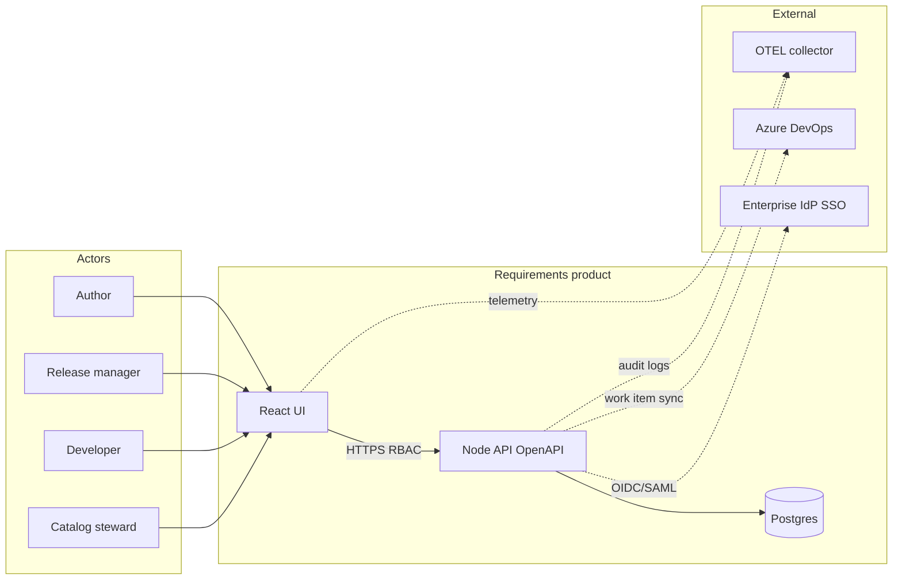
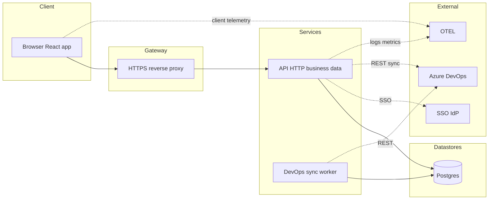
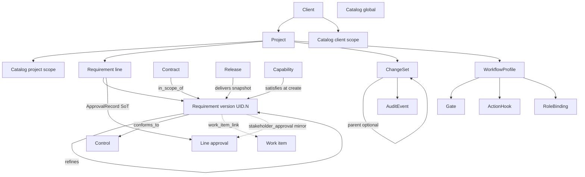
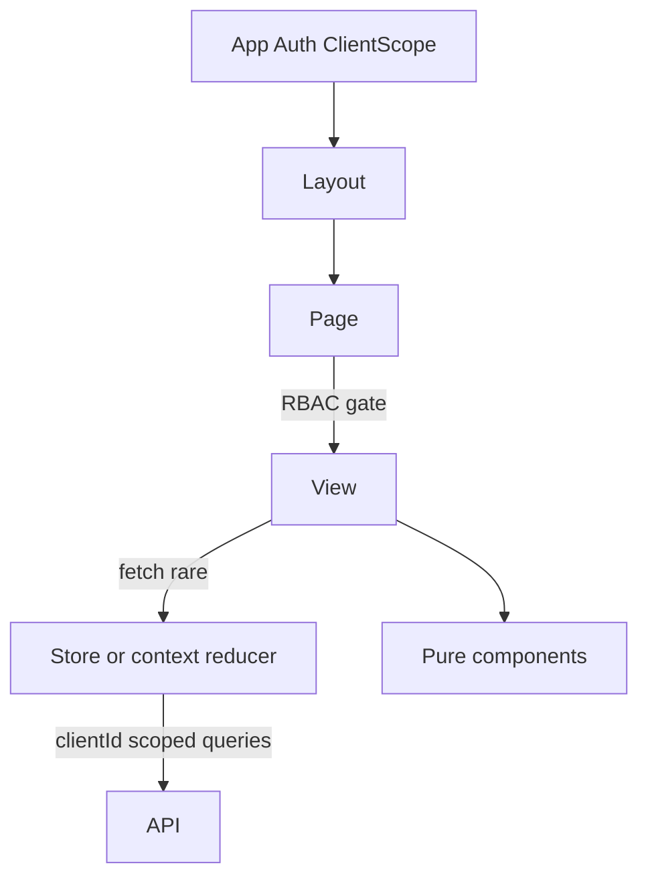
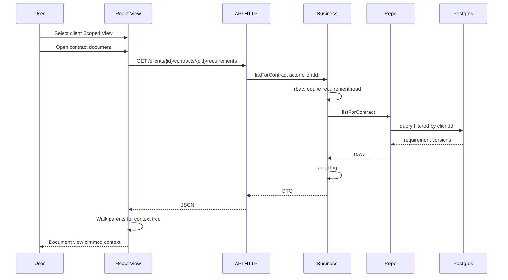
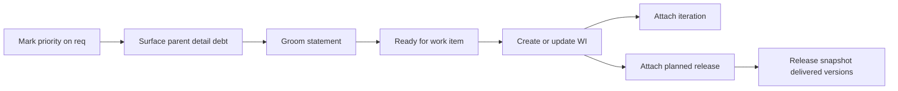

# Requirements product — architecture, context, data flow

Locked 2026-10-06: Client→Project hierarchy, contracts as related objects, `.N` requirement versions, TS/Node schema-first, Scoped View by client.

## 1. System context

## 2. Runtime architecture

## 3. Domain object graph

## 4. UI data ownership

## 5. Request data flow — contract document view

## 6. Priority to work item flow

## 7. C4 sequence diagrams

PlantUML sources under [`c4/sequences/`](./c4/sequences/). Canonical tracked copies live in **sdoc-intake** `docs/design/c4/sequences/` (INDEX + companions).

Workflow / Cyber+QA (ActionHook pipeline via `HookEval` / `GateCheck` / `HookEffectsAfter`):

| ID | Diagram |
|----|---------|
| WF01 | ActionHook evaluator (shared) |
| MC02 | MCP draft mutate (not mint) |
| D12 | Approve line (+ clears planning_blocked / D39f) |
| D39d | Mint successor with mint_kind |
| D39g | Gate sign-off |
| E41 / E41a | ConformsTo pin request / apply-deny |
| E46a | Suspect queue |
| G61 | Ship release (`cyber_gate` trigger; `gate_signoff` pass) |
